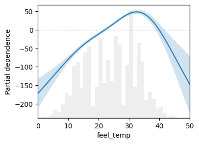
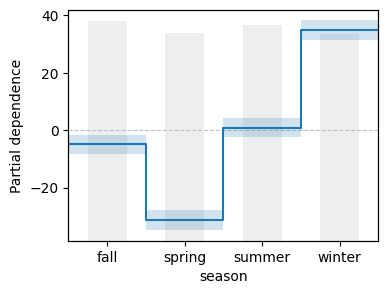
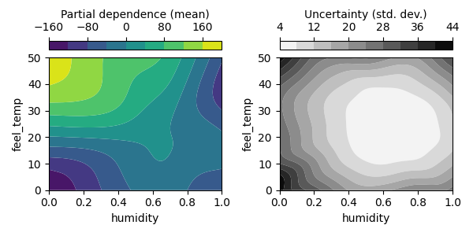
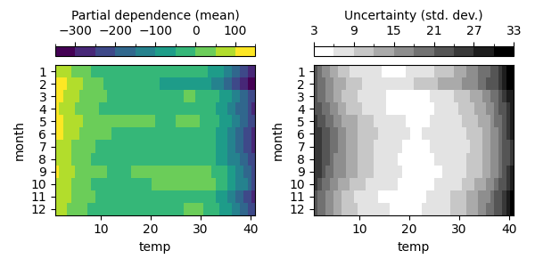

# Laplace-Approximated Neural Additive Models

Official implementation of Laplace-approximated neural additive models (LA-NAMs) presented in our paper:

> **[Improving Neural Additive Models with Bayesian Principles]**<br>
> [Kouroche Bouchiat], [Alexander Immer], [Hugo Yèche], [Gunnar Rätsch] and [Vincent Fortuin]
>
> ETH Zürich, TU Munich and Helmholtz AI

[Improving Neural Additive Models with Bayesian Principles]: https://proceedings.mlr.press/v235/bouchiat24a.html
[Kouroche Bouchiat]: https://bouchi.at/
[Alexander Immer]: https://aleximmer.github.io/
[Hugo Yèche]: https://bmi.inf.ethz.ch/people/person/hugo-yeche
[Gunnar Rätsch]: https://bmi.inf.ethz.ch/people/person/gunnar-raetsch
[Vincent Fortuin]: https://fortuin.github.io/

LA-NAMs are a Bayesian variant of the NAMs of [Agarwal et al., 2024], which rely on linearized Laplace inference to disentangle the uncertainty of the individual feature subnetworks.
This formulation also enables implicit feature selection, and automatic detection of feature interactions for use in two-stage training.

[Agarwal et al., 2024]: https://arxiv.org/abs/2004.13912

The laplace-skorch package in this repository contains implementations of LA-NAMs for regression and binary classification along with the code necessary to visualize them.
It also has generic wrappers for training of models with uncertainty estimation and marginal-likelihood optimization based on the [skorch] and [laplace-torch] APIs.

[skorch]: https://github.com/skorch-dev/skorch
[laplace-torch]: https://github.com/aleximmer/Laplace

## Installation

The package can be installed directly via Git, ideally within a fresh virtual environment.
It was written to be compatible with Python 3.11 and above.
PyTorch 2.0 and above is also preferred for full compatibility.

```shell
pip install git+https://github.com/fortuinlab/LA-NAM.git
```

## Examples

In the examples below we use the freely-available [bike sharing dataset] from the UCI data repository.
The goal is to predict the number of bike rentals using weather and season data as well as date and time information.

[bike sharing dataset]: https://archive.ics.uci.edu/dataset/275/bike+sharing+dataset

```python
from sklearn.datasets import fetch_openml
from sklearn.model_selection import train_test_split

# Use `as_frame` to load dataset as `pandas.DataFrame`.
X, y = fetch_openml(
    name="Bike_Sharing_Demand", version=2, return_X_y=True, as_frame=True
)

# Split into train and test data subsets.
X_train, X_test, y_train, y_test = train_test_split(
    X, y, test_size=0.2, random_state=42
)
```

### Fitting and evaluating

The package has two ready-to-use estimators, `laplace_skorch.regressor.LaplaceAdditiveNetRegressor` and `laplace_skorch.classifier.LaplaceAdditiveNetBinaryClassifier`.
The regressor is used below, but the API for binary classification is mostly equivalent.

> [!IMPORTANT]
> Instantiation of the subnetworks depends on the dtypes of the features.
> Datasets with both numerical and categorical features are supported, but require passing in data with `pandas.DataFrame` objects.
> Numerical features must have `float32` or `float64` dtypes.
> If you have features which have `integer` dtype but are intended to be numerical you must cast them beforehand.

```python
import torch
import torch.nn as nn
from laplace_skorch.regressor import LaplaceAdditiveNetRegressor

net = LaplaceAdditiveNetRegressor(
    # Hidden dimensions of the subnetworks (default: [64])
    module__hidden_dims=[64],
    # Activation layer of the subnetworks (default: nn.GELU)
    module__activation_cls=nn.GELU,
    # Model optimizer (default: torch.optim.Adam)
    optimizer=torch.optim.Adam,
    # Learning rate of the model optimizer (`lr` or `optimizer__lr`)
    lr=1e-3,
    # Total number of epochs in the first-stage
    max_epochs=1_000,
    # Batch size of the training data iterator
    batch_size=512,
    # Hyper-parameter optimizer (default: torch.optim.Adam)
    hyper_optimizer=torch.optim.Adam,
    # Learning rate of the hyper-parameter optimizer
    hyper_optimizer__lr=0.1,
    # Number of hyper-optimization steps
    hyper_steps=10,
    # Frequency in epochs of hyper-optimization
    hyper_epoch_freq=10,
    # Burn-in period in epochs before hyper-optimization
    hyper_epoch_burnin=20,
    # Device used for training (default: 'cpu')
    device="cpu",
)

# Fit the model.
net.fit(X_train, y_train)

# Get predictions and uncertainty for unseen data ...
y_pred, y_std = net.predict(X_test, return_std=True)

# ... or directly compute the test log-likelihood.
log_likelihood = net.score(X_test, y_test)
```

### Inspecting and visualizing

The package contains multiple helpers for inspecting and visualizing the feature subnetworks individually.
You can use `subnetwork_outputs_for_X` and `subnetwork_covar_for_X` to get the predictions and uncertainty from each of the subnetworks over transformed data.

```python
from laplace_skorch.inspection import subnetwork_outputs_for_X, subnetwork_covar_for_X

# Sample test data and apply feature transforms.
X_sample = torch.tensor(
    net.column_transformer_.transform(X_test.iloc[:5]), dtype=torch.float32
)

# Get predictions and uncertainty for each feature subnetwork.
f_pred = torch.zeros(len(X_sample), len(net.module_))
f_cov = torch.zeros(len(X_sample), len(net.module_))

for idx, key in enumerate(net.module_):
    f_pred[:, idx] = subnetwork_outputs_for_X(net, net.module_[key], X_sample).ravel()
    f_cov[:, idx] = subnetwork_covar_for_X(net, net.module_[key], X_sample).ravel()

# Transform back to target scale (in regression only.)
f_pred = f_pred * net.target_transformer_.scale_
f_std = torch.sqrt(f_cov * net.target_transformer_.scale_)
```

Alternatively, you can use `LaplaceAdditivePartialDependenceDisplay` to visualize the response of the subnetworks over a range of feature input values.
The API is intended to be similar to sklearn's [`PartialDependenceDisplay`].

[`PartialDependenceDisplay`]: https://scikit-learn.org/stable/modules/generated/sklearn.inspection.PartialDependenceDisplay.html

```python
from laplace_skorch.inspection import LaplaceAdditivePartialDependenceDisplay

# Display the response for `feel_temp` and input feature density.
LaplaceAdditivePartialDependenceDisplay.from_estimator(net, X, features="feel_temp")
```



Features are specified using their column name or index.
Categorical features are also supported:

```python
# Display the response for `season` and input feature density.
LaplaceAdditivePartialDependenceDisplay.from_estimator(net, X, features="season")
```



If you are interested in the raw response values you can use the `laplace_skorch.inspection.partial_dependence` helper to generate them directly.

### Fitting 2nd-order terms

The detection and fitting of feature interactions is implemented with a callback.
The `LaplaceAdditive2ndStage` callback can be added before calling `.fit(...)` to perform both training stages in a single go.

```python
from laplace_skorch.callbacks import LaplaceAdditive2ndStage

net = LaplaceAdditiveNetRegressor(
    ...,
    # Detect feature interactions and handle 2nd-stage fitting
    callbacks=[("stage_two", LaplaceAdditive2ndStage)],
    # Number of interactions to append after finishing 1st-stage
    callbacks__stage_two__interactions=10,
    # Method to use for feature interaction detection ('mutinf' or 'marglik')
    callbacks__stage_two__method="mutinf",
    # Number of additional epochs in the 2nd-stage
    callbacks__stage_two__max_epochs=1_000,
)

# Fit both stages.
net.fit(X_train, y_train)
```

Feature interactions can be also be detected and fitted post-hoc for trained models by appending the callback.
In this case, you must use `.partial_fit(..., epochs=0)` to avoid running the 1st-stage a second time.

```python
# Add the 2nd-stage callback to an already fitted net.
net.callbacks_.append(
    (
        "stage_two",
        LaplaceAdditive2ndStage(interactions=10, method="mutinf", max_epochs=1_000),
    )
)

# Skip the 1st-stage by calling `.partial_fit(..., epochs=0)`.
net.partial_fit(X_train, y_train, epochs=0)
```

Both the `partial_dependence` and `LaplaceAdditivePartialDependenceDisplay` helpers support inspection and visualization of 2nd-order terms by passing them to `from_estimator(...)`.

```python
display = LaplaceAdditivePartialDependenceDisplay.from_estimator(
    net, X, features=["humidity", "feel_temp"]
)

fig, axes = plt.subplots(ncols=2, figsize=(8, 4))
display.plot(ax=axes[0], display_type="mean")
display.plot(ax=axes[1], display_type="stddev")
```



It is possible to detect interactions with mixed feature types (categorical and numerical).
These are also supported:

```python
display = LaplaceAdditivePartialDependenceDisplay.from_estimator(
    net, X, features=["month", "temp"]
)
...
```



## License

The package is MIT-licensed.
See the LICENSE file for details.

## Citation

If you use LA-NAMs in your work, please consider citing as follows:

```bibtex
@inproceedings{bouchiat2024improving,
  title     = {Improving {{Neural Additive Models}} with {{Bayesian Principles}}},
  author    = {Bouchiat, Kouroche and Immer, Alexander and Y\`{e}che, Hugo and Ratsch, Gunnar and Fortuin, Vincent},
  booktitle = {Proceedings of the 41st International Conference on Machine Learning},
  pages     = {4416--4443},
  year      = {2024},
  publisher = {PMLR},
}
```
